# BGP Bangladesh: Full Classification Pipeline

This document describes the complete algorithm from external API queries to final ASN classification.

## Pipeline Overview

The pipeline has 7 phases:
1. **External API Queries** — Gather raw BGP data and country resources from RIPEstat
2. **AS Path Analysis** — Parse routes, identify border crossings using walk-backwards algorithm
3. **Edge Selection & Customer Detection** — Select top edges, determine which gateways serve domestic customers
4. **Enrichment Queries** — Resolve ASN names, geolocation, PeeringDB peering data, and BTRC license status
5. **Classification Decision Tree** — Assign each ASN to one of 6 categories
6. **Edge Classification** — Label edges as international or domestic
7. **Output** — Write `viz_data.json`, `asn_names.json`, `metadata.json`

## Diagram

The standalone Mermaid source is at [`classification-pipeline.mmd`](classification-pipeline.mmd). Exported images: [`classification-pipeline.svg`](classification-pipeline.svg), [`classification-pipeline.png`](classification-pipeline.png).

```mermaid
---
title: "BGP Bangladesh: Full Classification Pipeline"
---
flowchart TB
    classDef apiNode fill:#4A90D9,stroke:#2C5F8A,color:#fff,font-weight:bold
    classDef processNode fill:#F5A623,stroke:#C47D0E,color:#fff,font-weight:bold
    classDef dataNode fill:#7ED321,stroke:#4A8A0E,color:#fff,font-weight:bold
    classDef classifyNode fill:#D0021B,stroke:#8B0013,color:#fff,font-weight:bold
    classDef resultNode fill:#9013FE,stroke:#5E0DA6,color:#fff,font-weight:bold
    classDef decisionNode fill:#50E3C2,stroke:#2DA88E,color:#000,font-weight:bold
    classDef edgeNode fill:#BD10E0,stroke:#7A0A92,color:#fff,font-weight:bold

    subgraph Phase1["Phase 1 — External API Queries"]
        direction TB
        API1["① RIPEstat<br/>country-resource-list<br/>resource=BD"]:::apiNode
        API1 --> |"ASN list + IPv4/v6 prefixes"| D1["country_asns set<br/>(all BD-registered ASNs)<br/>+ allocated_prefixes"]:::dataNode
        API2["② RIPEstat<br/>announced-prefixes<br/>(per BD ASN, 8 parallel)"]:::apiNode
        D1 --> API2
        API2 --> |"actually-announced prefixes"| D2["merged_prefixes<br/>(allocated ∪ announced)"]:::dataNode
        API3["③ RIPEstat<br/>bgp-state<br/>(batched by URL length)"]:::apiNode
        D2 --> API3
        API3 --> |"{ target_prefix, source_id, path[] }"| D3["raw BGP routes<br/>(deduplicated by<br/>prefix + collector)"]:::dataNode
    end

    subgraph Phase2["Phase 2 — AS Path Analysis"]
        direction TB
        P1["Clean AS Paths<br/>• Remove AS-prepending<br/>• Deduplicate consecutive ASNs<br/>• Skip malformed routes"]:::processNode
        D3 --> P1
        P2["Walk-Backwards Algorithm<br/>For each path, walk right→left<br/>from origin while ASN ∈ country_asns"]:::processNode
        P1 --> P2
        P3["Identify 3 Key ASNs:<br/>• OUTSIDE = last non-BD ASN<br/>• GATEWAY = first BD ASN<br/>• ORIGIN = rightmost ASN"]:::processNode
        P2 --> P3
        P4["Accumulate Counters:<br/>• outside_counts<br/>• iig_counts<br/>• edge_intl outside→gateway<br/>• edge_domestic origin→gateway<br/>• direct_peers adjacency"]:::processNode
        P3 --> P4
    end

    subgraph Phase3["Phase 3 — Edge Selection & Customer Detection"]
        direction TB
        E1["Select Top Edges:<br/>• top 1500 international edges<br/>• top 2000 domestic edges"]:::processNode
        P4 --> E1
        E2["Build iigs_with_domestic set<br/>= all gateway ASNs that appear<br/>as TARGET of a domestic edge"]:::processNode
        E1 --> E2
    end

    subgraph Phase4["Phase 4 — Enrichment Queries"]
        direction TB
        API4["④ RIPEstat<br/>as-overview<br/>(per unique ASN)"]:::apiNode
        API4 --> |"holder name + announced bool"| D4["ASN names & countries<br/>(parsed from holder string)"]:::dataNode
        API5["⑤ RIPEstat<br/>maxmind-geo-lite-<br/>announced-by-as<br/>(per gateway ASN)"]:::apiNode
        API5 --> |"IP geolocation breakdown"| D5["geo_country &<br/>dominant_country<br/>per ASN"]:::dataNode
        API6["⑥ PeeringDB<br/>net + ix APIs<br/>(batch by ASN list)"]:::apiNode
        API6 --> |"facilities, IXP memberships"| D6["peering_country &<br/>peering_details<br/>per gateway ASN"]:::dataNode
        API7["⑦ BTRC License List<br/>btrc_iig_licenses.json<br/>(static local file)"]:::apiNode
        API7 --> D7["btrc_licensed_asns set<br/>(38 ASNs across ~26 companies)"]:::dataNode
    end

    E2 --> Phase4

    subgraph GeoLogic["Dominant Country Logic"]
        direction TB
        G1{"BD IP % > 80%?"}:::decisionNode
        G1 -->|"YES"| G2["dominant_country = BD"]:::dataNode
        G1 -->|"NO"| G3["dominant_country =<br/>highest non-BD country"]:::dataNode
    end

    D5 --> GeoLogic

    subgraph Phase5["Phase 5 — Classification Decision Tree"]
        direction TB
        C0["For each ASN appearing<br/>at the border crossing<br/>(tentative type = iig)"]:::classifyNode
        C1{"ASN in<br/>btrc_licensed_asns?"}:::decisionNode
        C0 --> C1
        C1 -->|"YES"| R1["✅ iig<br/>Licensed International<br/>Internet Gateway"]:::resultNode
        C1 -->|"NO"| C2{"BD-registered<br/>AND<br/>geo_country ≠ BD?"}:::decisionNode
        C2 -->|"YES (offshore)"| C3{"Has domestic<br/>customers?<br/>(ASN ∈ iigs_with_domestic)"}:::decisionNode
        C3 -->|"YES"| R2["⚠️ offshore-gateway<br/>Rogue: abroad +<br/>selling BD transit"]:::resultNode
        C3 -->|"NO"| R3["🏢 offshore-enterprise<br/>Harmless: abroad,<br/>no BD customers"]:::resultNode
        C2 -->|"NO (domestic)"| C4{"Has domestic<br/>customers?<br/>(ASN ∈ iigs_with_domestic)"}:::decisionNode
        C4 -->|"YES"| R4["🔍 detected-iig<br/>Unlicensed gateway<br/>acting as IIG"]:::resultNode
        C4 -->|"NO"| R5["🏠 local-company<br/>Demoted: no<br/>downstream customers"]:::resultNode
    end

    Phase4 --> Phase5
    GeoLogic --> Phase5

    subgraph OtherTypes["Non-Border ASN Types"]
        direction LR
        R6["🌐 outside<br/>International transit<br/>provider (non-BD)"]:::resultNode
        R7["🏠 local-company<br/>Origin ASN announcing<br/>its own BD prefix"]:::resultNode
    end

    P3 --> |"OUTSIDE ASN (non-BD)"| R6
    P3 --> |"ORIGIN ASN (BD, not a gateway)"| R7

    subgraph Phase6["Phase 6 — Edge Classification"]
        direction LR
        EC1["international edge<br/>outside → gateway<br/>(traffic entering BD)"]:::edgeNode
        EC2["domestic edge<br/>local-company → gateway<br/>(internal transit)"]:::edgeNode
    end

    Phase5 --> Phase6

    subgraph Phase7["Phase 7 — Output"]
        direction LR
        O1["viz_data.json<br/>nodes + edges + stats"]:::dataNode
        O2["asn_names.json<br/>ASN registry"]:::dataNode
        O3["metadata.json<br/>pipeline metadata"]:::dataNode
    end

    Phase6 --> Phase7
```

## External API Endpoints

| # | Endpoint | Provider | Purpose |
|---|---|---|---|
| ① | `country-resource-list/data.json?resource=BD` | RIPEstat | Get all BD-registered ASNs and allocated IP prefixes |
| ② | `announced-prefixes/data.json?resource=AS{n}` | RIPEstat | Get actually-announced prefixes per ASN (catches sub-allocations) |
| ③ | `bgp-state/data.json?resource={prefixes}` | RIPEstat | Bulk BGP route state — full AS paths for all BD prefixes |
| ④ | `as-overview/data.json?resource=AS{n}` | RIPEstat | ASN holder name and announcement status |
| ⑤ | `maxmind-geo-lite-announced-by-as/data.json?resource=AS{n}` | RIPEstat | IP geolocation — physical location of ASN's address space |
| ⑥ | `peeringdb.com/api/net` + `peeringdb.com/api/ix` | PeeringDB | Facility and IXP membership data for peering location |
| ⑦ | `btrc_iig_licenses.json` (local) | BTRC | Static list of licensed International Internet Gateway operators |

## Classification Categories

| Category | Icon | Meaning |
|---|---|---|
| **iig** | ✅ | BTRC-licensed International Internet Gateway |
| **detected-iig** | 🔍 | Unlicensed ASN acting as a gateway with BD downstream customers |
| **offshore-gateway** | ⚠️ | BD-registered, infrastructure abroad, selling transit to BD networks |
| **offshore-enterprise** | 🏢 | BD-registered, infrastructure abroad, no BD customers (harmless) |
| **local-company** | 🏠 | Domestic origin network or demoted gateway with no customers |
| **outside** | 🌐 | International transit provider (non-BD ASN) |

## Key Decision Points

### Walk-Backwards Algorithm
For each BGP route's AS path `[foreign, ..., foreign, gateway, domestic, ..., origin]`:
1. Start at the rightmost ASN (origin)
2. Walk left while the ASN belongs to `country_asns` (BD-registered)
3. The first BD ASN encountered is the **gateway** (border crossing)
4. The ASN immediately to its left is the **outside** (international transit)

### Dominant Country Logic
From MaxMind geolocation data for a gateway ASN:
- If >80% of the ASN's IP space geolocates to BD → `dominant_country = "BD"`
- Otherwise → the non-BD country with the highest coverage percentage

### Has Domestic Customers
An ASN "has domestic customers" if it appears as the **target** of any top domestic edge — meaning at least one other BD network routes through it.
